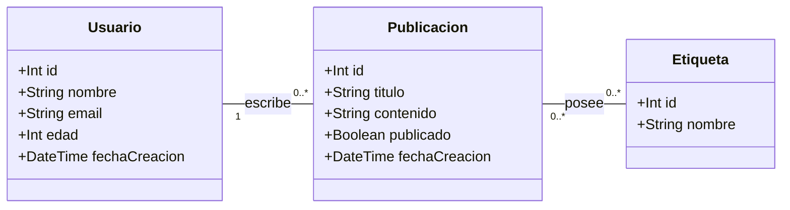

# PoC OxM: Comparativa de ORMs (Prisma y Drizzle)

**Universidad Tecnológica Nacional – Facultad Regional Rosario (UTN FRRo)**  
**Cátedra:** Desarrollo de Software (DSW) – Ciclo Lectivo 2026  
**Comisión:** 304  

### Integrantes del Grupo
#### Prisma
- **53742** – Nicolás Bolzico  
- **53952** – Martín Cabrera  
- **52285** – Agustín Gregoret  
#### Drizzle
- **54326** – Roque Doino  
- **54689** – Juan Pablo Villa  

## 1. ¿De qué se trata esta PoC?

Esta prueba de concepto compara dos de los **ORM** más modernos, populares y relevantes del ecosistema TypeScript/Node.js trabajando sobre una base de datos relacional. Ambas tecnologías fueron puestas a prueba resolviendo las mismas operaciones.

## 2. Modelo de Dominio

El dominio modelado simula un sistema de publicaciones con usuarios y categorización por etiquetas, típico de cualquier foro en una página web

## 3. Operaciones Evaluadas en la Demostración

1. **Modelado (Definición de Esquema)**
   - **Prisma:** Esquema definido en archivo [schema.prisma](./Prisma/schema.prisma) 
   - **Drizzle:** Esquema definido en TypeScript en [drizzleOrm.ts](./Drizzle/drizzleOrm.ts)

2. **Escritura (Registro de Datos y Validaciones)**
   - Inserción de usuarios con relaciones anidadas o referenciadas.
   - Demostración de validaciones (rechazo de correos duplicados por clave única).

3. **Lectura (Consulta Compleja con Filtros Relacionales)**
   - **Criterio de búsqueda:** *Buscar publicaciones con la etiqueta `"meme"` cuyo autor sea mayor a 18 años*.

---
Cada tecnología cuenta con su archivo de instrucciones para ejecutar el código detallado. 